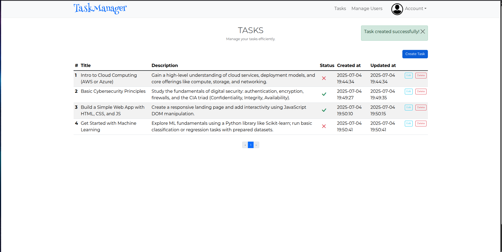
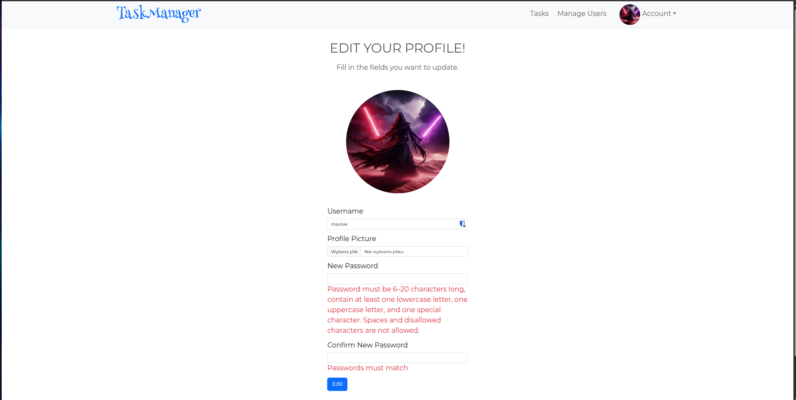
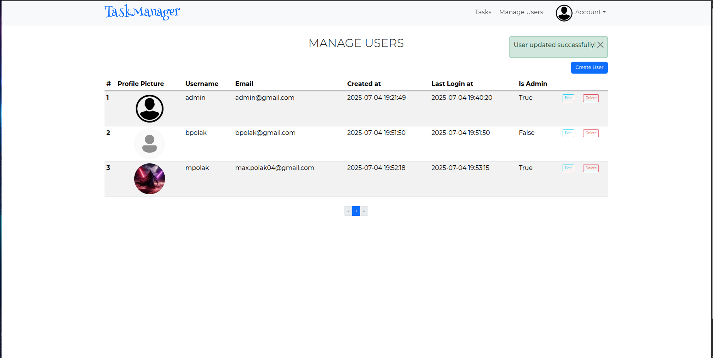
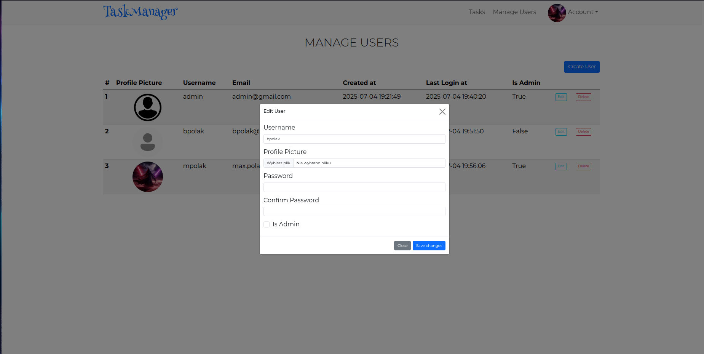

# 🗂️ Flask TaskManager



---

## 📌 Project Description

**Flask TaskManager** is a classic CRUD application built to manage user tasks. While the concept may be simple, the **implementation is robust and production-ready**, with a strong focus on **security**, **modular design**, and **scalability**.

🔐 The app implements advanced security and access management features:

- ⚙️ Jinja2 templating — dynamic view rendering and safe code injection
- 🧑‍⚖️ Role-based access — anonymous users, authenticated users, and admins
- 🔐 View protection — decorators and route-based permissions
- 🔑 Strong password policy + custom validation rules
- 🛡️ Protection against:
  - SQL injection (SQLAlchemy + Flask-WTF)
  - CSRF attacks (Flask-WTF with tokens)
  - XSS scripting (Flask-WTF + Jinja2 escaping)
  - Brute-force & DoS attacks (Flask-Limiter[redis])
- 💾 Secure sessions via HTTP-only cookies
- 🌐 HTTP header hardening + forced HTTPS (Flask-Talisman):
  - Content-Security-Policy
  - Strict-Transport-Security
  - Referrer-Policy
  - X-Frame-Options
  - X-Content-Type-Options

🧯 Built-in error pages for:
- 403 — Forbidden Access  
- 404 — Page Not Found  
- 500 — Internal Server Error  

...all styled with user-friendly graphical templates.

The project supports full task and user management, including role assignment, session management, access control, and administrator dashboards.

---

## ⚡️ Quickstart

Choose one of two options:

---

### 🟢 Option A — GitHub Codespaces

🖥️ *Requires a GitHub account*

1. Click **[Open in Codespaces](#)** *(insert actual link)*
2. Wait for the environment to initialize (≈1–2 min)
3. Run the app:
   ```
   docker compose up --build
   ```
4. Open the preview URL, e.g. `https://<your-preview-url>`

---

### 📦 Option B — Run Locally via Docker Compose

1. Install [Docker](https://docs.docker.com/get-docker/) + [Docker Compose](https://docs.docker.com/compose/)
2. Download only the Compose file:
   ```
   curl -O https://yourdomain.com/docker-compose.yml
   ```
3. Run the app:
   ```
   docker compose up
   ```
4. Open your browser at: `https://localhost`

---

### 🔑 Default Admin Credentials

Available on first launch:

- **Email**: `admin@gmail.com`  
- **Password**: `Pa$$w0rd`

You can log in with this account to test functionality, create users, assign admin rights, and manage tasks.

---

## 🧰 Technologies Used

### 🧱 Tech Stack

- Python 3.12
- Flask
- MySQL
- Redis
- NGINX
- Docker + Docker Compose
- HTML / CSS / JavaScript

### 📦 Python Libraries

- `Flask-Login` — session and login management
- `Flask-Migrate` — database migrations via Alembic
- `Flask-SQLAlchemy` — ORM for SQL queries
- `Flask-WTF` — form handling, CSRF tokens, and field validation
- `Flask-Limiter[redis]` — request limiting, brute-force/DoS protection
- `Flask-Talisman` — HTTP security headers + HTTPS enforcement
- `python-dotenv` — environment variable support
- `pymysql` — MySQL driver for SQLAlchemy
- `cryptography` — secure hashing and encryption
- `email_validator` — RFC-compliant email validation
- `gunicorn` — production WSGI server

---

## 🧠 What I Learned

- How to build a secure Flask web app with advanced user access control
- Integrating Redis, NGINX, MySQL, and HTTPS into a production-ready environment
- Creating containerized environments using Docker and Compose
- Navigating and applying Flask libraries via documentation and problem-solving
- Designing scalable, modular codebases
- Using the application factory design pattern

---

## 📦 Project Status & Future Plans

✅ This project is **complete and stable**, ready for demonstration or deployment.  
But I also have plans for future features and improvements:

- [ ] Unit testing using Pytest
- [ ] Full environment separation (dev, staging, production)

---

## 🖼️ Gallery

A closer look at key screens within the app:

### ✅ Password Validation Feedback



### 👥 Admin View: User Management Panel



### 🔐 Sign-in Page


### 📝 Editing a User Profile (Admin Panel)



---

Thanks for checking out the project! Let me know if you'd like a deployment walkthrough, GitHub Actions integration, or a demo landing page 🌐🚀
